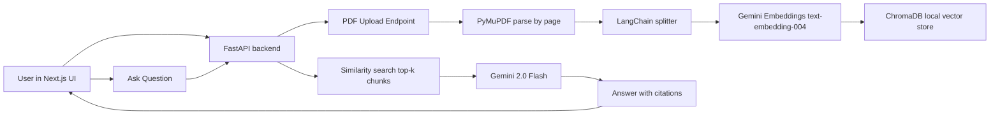

# RAG System Architecture

## Notes

- Upload flow stores PDF in `uploads/`, parses page text, chunks it, then indexes embeddings in ChromaDB.
- Ask flow retrieves relevant chunks, builds context, and asks Gemini for a grounded answer.
- Streaming flow returns SSE tokens first, then final citation metadata.
